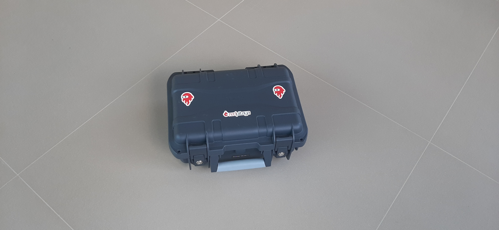
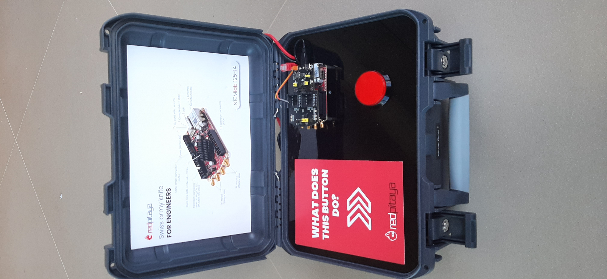

# RedPitayaRedditCompetition
**This serves as an example for the Red Pitaya Reddit Competition Submission of Your Project**

# Red Pitaya Reaction Time Measurement Game

This project involves a reaction time measurement application developed using Python in JupyterNotebook, targeting integration with the Red Pitaya board. The software is designed to assess user reaction times based on visual cues (colored circles) and button presses. Key components include a user interface for displaying instructions and results, threading for timekeeping, and data management features to maintain and display a leaderboard.

The application's flow starts by inviting users to initiate the test, followed by a randomized waiting period marked by a red circle. Once the green circle appears, users must react by pressing a button, recording their reaction time. If users react prematurely (before the green circle), they're directed to a retry state. After each session, the reaction time is recorded, and the software updates a leaderboard reflecting top performers. Users can also switch between viewing their reaction time statistics and the leaderboard.

Additional features include email and company data collection for a more personalized experience, and statistical analysis with histogram and Gaussian fit plotting to visualize overall performance distributions among participants. This setup is intended for interactive public or educational displays, emphasizing engagement and competition. The whole projects comes in a portable Demo box, which makes it very portable:

## Materials used for project:

1x	Small Demo Box  

1x	Graverstvo Grilj plate 

1x	Asus router

1x	Screws, zip-ties, plastic mounting parts 

1x	Power supply rail and 5 meter power cable 

1x	12 V Power supply

1x	Big Red Arcade button
	
	
1x	Red Pitaya SD Card

1x	Red Pitaya STEMlab125-14

1x	Red Pitaya Click Shield

1x	Red Pitaya 5V 2A Power Supply

2x	Ethernet cables

# Pictures and Hardware description

Here we have an open portable case containing a Red Pitaya STEMlab 125-14 board, known for its versatility in electronics and engineering applications. The board is equipped with a click shield which enables easy connection to various modules, such as the large red arcade button prominently featured in the setup. The button is designed to be user-friendly and is likely used to initiate the reaction time measurement game mentioned in the project description.

For connectivity, there's an ethernet cable which provides network access to the board, crucial for tasks that require internet connection or local network communication. The power supply is ensured by a dedicated cable, which is standard 5V 2A Red Pitaya Power supply

The wiring between the Red Pitaya board and the click shield seems straightforward and neatly organized, minimizing the risk of loose connections or interference. The specific mention of the click shield pin INT on slot 2 indicates that this pin is configured to read the signal from the button, which is integral to the reaction game's functionality. This suggests that the setup is not only robust but also carefully planned to ensure reliable performance during demonstrations or interactive sessions.

# Code explanation

The provided code script is a Python application for measuring and analyzing user reaction times. It's structured into several key parts:

**Library Imports and Initialization:**

The script begins by importing necessary Python libraries for handling data, plotting, and interfacing with the Red Pitaya hardware.
It initializes the Red Pitaya board and sets up various HTML and widget elements to manage the user interface.

**User Interface (UI) Components:**

Multiple functions create HTML elements to display messages, buttons, and circles of different colors, which guide the user through the application.
Widgets are used to display data dynamically, including reaction times, user inputs, and messages about the user's performance.

**Data Handling Functions:**

These functions manage user data, including checking if data files exist, reading data, updating, and saving it. They ensure that user information and reaction times are stored and retrieved correctly.

**Timer Functions:**

A set of functions and classes manage timing operations, crucial for measuring precise reaction times. They handle the timing of visual cues (red to green circles) and user reactions.
Timers also manage timeouts and delays, ensuring users react within a given timeframe and controlling the flow of the application.

**Main Program Loop:**

The main loop of the program is where the application's states are managed. It switches between different states like waiting for a user to start, collecting user data, timing user reactions, and displaying results.
The loop checks button presses, manages state transitions based on user actions, and updates the display accordingly.

**Display and Logging:**

The application includes functionality to display leaderboards, individual reaction times, and statistical analysis.
It logs new user data into a CSV file and recalculates statistics to reflect new entries.

Overall, the script is a complex integration of hardware control, data management, and user interface elements, designed to create an engaging and interactive environment for measuring and analyzing reaction times.

